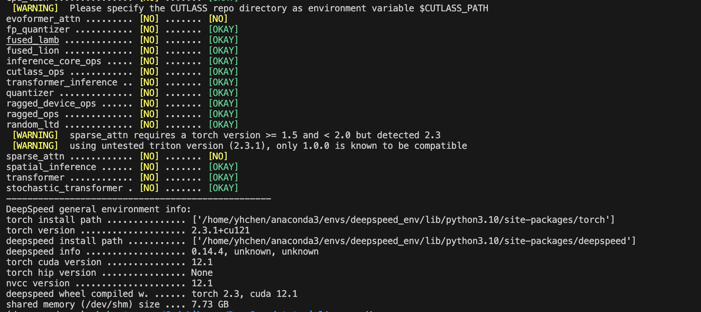

# DeepSpeed

---

## Installation

到目前时间(2024.7.22) 在 [DeepSpeed](https://github.com/microsoft/DeepSpeed#windows) github中说明了 `Windows` 仅支持推理，本次实验是在 `Linux` 环境下进行。

1. 安装
```bash
pip install deepspeed
```

2. 测试安装成功
```bash
ds_report
```

出现下面信息：




<br>
<br>


## Example

microsoft 官方提供的案例(已经下载)：
```bash
git clone git@github.com:microsoft/DeepSpeedExamples.git
```

`cifar-10` 模型需要的包:
```bash
pip install torchvision pillow matplotlib
```

到 执行 `DeepSpeedExamples/training/cifar` 中执行 `python cifar10_tutorial` 


<br>
<br>


## 使能DeepSpeed

### 1. 参数解析

向模型中添加 `DeepSpeed` 参数，使用函数 `deepspeed.add_config_argument()`

```python
 import argparse
 import deepspeed

 def add_argument():

     parser=argparse.ArgumentParser(description='CIFAR')

     # Data.
     # Cuda.
     parser.add_argument('--with_cuda', default=False, action='store_true',
                         help='use CPU in case there\'s no GPU support')
     parser.add_argument('--use_ema', default=False, action='store_true',
                         help='whether use exponential moving average')

     # Train.
     parser.add_argument('-b', '--batch_size', default=32, type=int,
                         help='mini-batch size (default: 32)')
     parser.add_argument('-e', '--epochs', default=30, type=int,
                         help='number of total epochs (default: 30)')
     parser.add_argument('--local_rank', type=int, default=-1,
                        help='local rank passed from distributed launcher')

     # Include DeepSpeed configuration arguments.
     parser = deepspeed.add_config_arguments(parser)

     args=parser.parse_args()

     return args
```

<br>


### 2. 初始化
使用 `deepspeed.initialize` 创建 `modek_engine`, `optimizer` 和 `trainloader` ：

```python
 # Initialize DeepSpeed to use the following features
 # 1) Distributed model.
 # 2) Distributed data loader.
 # 3) DeepSpeed optimizer.
 model_engine, optimizer, trainloader, _ = deepspeed.initialize(args=args, model=net, model_parameters=parameters, training_data=trainset)
```

